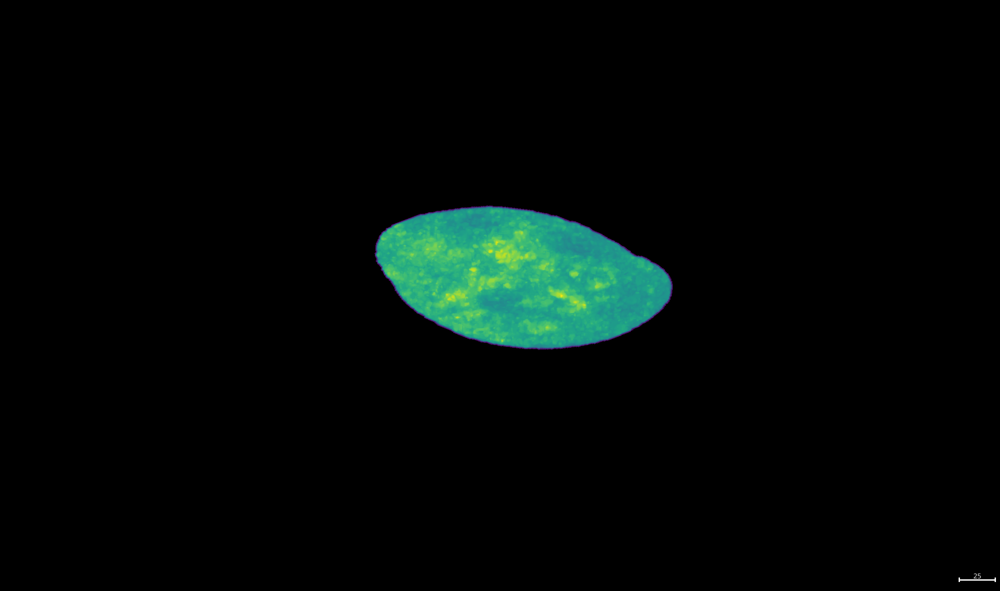
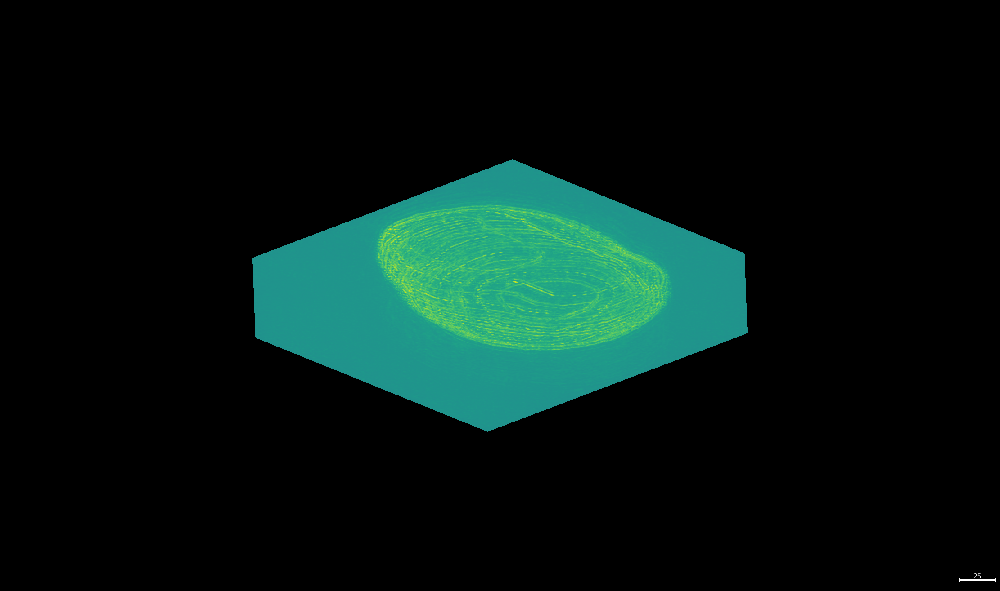

# OCT Simulation for WTC-11-hiPS Cells

This project simulates Optical Coherence Tomography (OCT) images from 3D cellular data. The simulation involves Fourier transformations and spectral filtering to mimic OCT imaging effects. The code processes 3D microscopy images and applies spectral masks stored in `.mat` files to simulate OCT scans.

## How the Simulation Works

1. **Loading the Image** – The script reads 3D microscopy images in `.tif` format.
2. **Preprocessing** – The relevant cellular region is extracted, and the best square section is selected.
3. **Rescaling** – The image is resized to match the spectral mask dimensions.
4. **Fourier Transform & Filtering** – The Fourier spectrum of the image is computed and filtered using a pre-defined mask.
5. **Inverse Fourier Transform** – The modified spectrum is transformed back into the spatial domain, generating the final OCT-like image.
6. **Saving Results** – The processed data is saved in `.h5` format for further analysis.

## File Descriptions

### **Main Scripts**
- **`Calculation.py`** – The core script that processes images, applies transformations, and generates OCT simulations.
- **`Support.ipynb`** – A Jupyter Notebook for visualizing 3D images with the `napari` library.

### **Mask Files**
The spectral masks are stored as `.mat` files in the format:
**EW_int_X_Y**

Where:
- `X` is the spectral dimension.
- `Y` is the spatial dimension.

For example, `EW_int_528_66.mat` corresponds to a mask of shape `(66, 528, 528)`.

## Class and Method Overview

### **ImageProcessor (Handles Image Processing)**
- **`masking_cell_area(image)`** – Extracts the relevant cellular region from the image.
- **`znajdz_najlepszy_kwadrat(obraz)`** – Finds the best square area within the image containing the most cell content.
- **`selsct_best_squere(cell_area)`** – Determines the optimal square section for processing.
- **`load_mask_EW(file_path)`** – Loads the spectral mask from a `.mat` file.
- **`rescale_to_target_shape(matrix, target_shape)`** – Rescales the image to match the mask dimensions using nearest-neighbor interpolation.
- **`cut_Fourier_spectrum(rescaled_matrix_cell, mask_matrix)`** – Applies Fourier Transform, multiplies by the spectral mask, and performs an inverse transform.
- **`save_to_H5_file(save_directory, file_name, rescaled_matrix_cell, real_part_inverse_fourier_transform)`** – Saves the processed images in `.h5` format.

### **MainProcess (Handles Execution)**
- **`run()`** – Iterates through all `.tif` files, processes them, applies OCT simulation, and saves results.

## Environment Setup
To recreate the computational environment, use the Conda environment file:

```bash
conda env create -f environment.yml
```

## Example Images

The `Images` directory contains sample outputs:

- **`The extracted cellular image before processing`**

- **` The corresponding OCT-like image after applying spectral filtering`**

